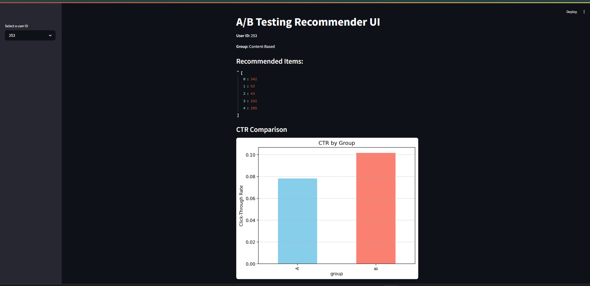

# A/B Testing Recommender System with Streamlit + MLflow

This project simulates and visualizes an A/B test comparing a baseline popularity-based recommender with a content-based TF-IDF recommendation model. It includes a fully interactive Streamlit UI and logs experiment results with MLflow.

---

## Demo Preview



---

## Features

- **A/B Group Assignment**: Users randomly assigned to Group A (baseline) or Group B (TF-IDF model)
- **Real Recommendations**: Content-based recommender using TF-IDF on item descriptions
- **CTR Simulation**: Click-through rate simulated for both groups
- **Lift Calculation**: CTR lift (%) computed and compared
- **Streamlit UI**: Interactive web app to test and view results
- **MLflow Integration**: Tracks user, group, CTR, and uplift metrics for each session

---

## How It Works

1. **Dataset**:
   - `Interactions.csv`: User-item interactions
   - `item_metadata_tfidf.csv`: Item descriptions

2. **Recommenders**:
   - **Baseline**: Top-N popular items
   - **TF-IDF**: Personalized ranking based on item description similarity

3. **A/B Logic**:
   - Group A: Receives baseline recommendations
   - Group B: Receives TF-IDF-based personalized recommendations

4. **Evaluation**:
   - CTR is simulated based on group
   - Lift is calculated: `(CTR_B - CTR_A) / CTR_A * 100`
   - Z-test can be run in `main.py` for statistical significance

---

## Project Structure

```
recommendation_ab_test/
├── data/
│   ├── movielens_synthetic_cleaned.csv
│   └── item_metadata_tfidf.csv
├── src/
│   ├── recommend_baseline.py
│   ├── recommend_new.py
│   ├── ab_test.py
│   └── evaluation.py
├── streamlit_app.py
├── main.py
├── requirements.txt
└── README.md
```

---

## Setup Instructions

1. **Install dependencies**
```bash
pip install -r requirements.txt
```

2. **Run Streamlit UI**
```bash
streamlit run streamlit_app.py
```

3. **Run offline batch evaluation**
```bash
python main.py
```

4. **View MLflow logs**
```bash
mlflow ui
```
Then open [http://localhost:5000](http://localhost:5000)

---

## Example A/B Test Output

| Group | CTR     |
|-------|---------|
| A     | 8.1%    |
| B     | 10.2%   |
| Lift  | +25.93% |

---

## Tools & Tech Stack

- Python
- Pandas, Numpy, scikit-learn
- Streamlit
- MLflow
- Matplotlib

---

## Author

**Swagath Babu**  
Machine Learning Engineer  
Santa Clara, CA  
[LinkedIn](https://linkedin.com/in/swagathb) | [GitHub](https://github.com/Swagath18)

---

## Future Improvements

- Add cold-start strategies for new users
- Integrate collaborative filtering or embedding-based models
- Support multi-arm bandit testing
- Deploy as a live recommender on Streamlit Cloud

---

##  License

MIT License © 2025 Swagath Babu